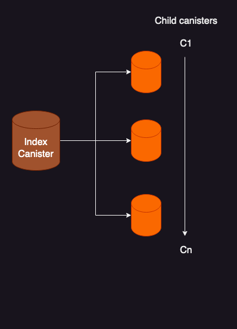
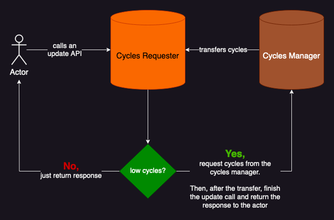

# cycles-manager
A library for index canisters that want to manage the cycles of their child canisters.

### This Library is Sponsored by the [CycleOps team](https://cycleops.dev) and the DFINITY Foundation**

[https://cycleops.dev](https://cycleops.dev) is automated canister cycles management for the Internet Computer.

## Motivation

Multi-canister applications tend to have the following architecture, with an index canister that holds the mapping and/or manages several child canisters. Currently, there is no library that developers can use to easily manage the cycles within a multi-canister architecture.



This cycles-manager library proposes a simple, flexible pattern for cycles management, with a Battery canister that implements the CyclesManager module and APIs, and a child canister that implements the CyclesRequester module.



## Examples

### A simple example!

The [example/](./example/) folder for contains a basic example using the cycles-manager. It implements the CyclesManager module in an [Battery](./example/Battery.mo) (i.e. index) canister actor and the CyclesRequester module in a [Child](./example/Child.mo) (i.e. service) canister actor.

To see it in action, perform the following
1. Clone this repository
2. Navigate to the example - `cd example`
3. Start up dfx - `dfx start --background --clean`
4. Deploy both the battery and child canisters `dfx deploy`
5. Configure the battery and child canisters. Using the links in your terminal:  
  a. Open up the Candid UI of the **battery** canister and call the `addCanisterWith1TrillionPer24HoursLimit()` API with the canister id of the **child** canister
  b. Open up the Candid UI of the **child** canister and call the `initializeCyclesRequester()` API with the canister id of the **battery** canister, as well as the conditions of the topup rule. A simple topup rule for this local example would be to topup **by_amount** 100000000000 (100 billion) when the canister has fewer than 5000000000000 (5 Trillion cycles)
6. Test the cycles-manager. Using the Candid UI of the **child** canister, call the `justAnotherCounterExample()` API, which before running the update first checks if a canister's cycles balance is below a threshold and requests cycles from the **battery** canister if they are needed.

#### What's happening under the hood?

Every time the `justAnotherCounterExample()` API is called, the **child** canister checks it's cycles balance and compares it to the topup rule that was set in its initialized `CyclesRequester` stable variable. Since it has fewer than 5T cycles, it follows the topup rule and requests 100 billion cycles from the **battery** canister. Because the **battery** canister has added the **child** canister with a 1T cycles per 24 hours quota, you should be able to call the ``justAnotherCounterExample()` function 10 times to request 100 billion cycles. On the 11th time, you will see a log showing that 100 billion cycles were requested, but the topup request was rejected by the CyclesManager of the **battery** canister with `#err(#canister_quota_reached)`. This is just one example of how the battery canister can limit the cycles requests of other child canisters. Check out all the quota types (#fixedAmount, #maxAmount, #rate, #unlimited) in [CyclesManager.mo](./src/CyclesManager.mo) to see which type of quota best suits your application use case.

### Using the cycles-manager with production applications via CycleOps

The cycles manager works great for managing the cycles of multi-canister applications, but at the end of the day you still need a tool for monitoring and managing the cycles of the **Battery** canister for your application. This is where using the [CycleOps service](https://cycleops.dev) gives you monitoring, accounting, and reliability with it trustless, automated cycles management. Want to learn more about CycleOps? Keep reading [here](https://forum.dfinity.org/t/meet-cycleops-proactive-automated-no-code-canister-management-for-the-internet-computer/20969).


## Concepts

### The Cycles Manager 
The Cycles Manager is placed in the index/battery canister and is responsible for transfering cycles to child canisters that request cycles and are permitted to do so by the cycles manager. It does this by: 
* Maintaining a list of all allowed child canisters, and ensuring child canisters do not request more than their alloted cycles quotas.
* Tracking the aggregate cycles apportioned to all canisters, ensuring that the battery/index canister does not transfer more cycles than alloted by the aggregate quota

You can initialize the `CyclesManager` by calling `CyclesManager.init()` with the appropriate settings.`

```
  CyclesManager.init({
    // By default, each child canister can request a maximum of 1T cycles every 24 hours
    defaultCyclesSettings = {
      quota = #rate({
        maxAmount = 1_000_000_000_000;
        durationInSeconds = 60 * 60 * 24;
      });
    };
    // In aggregate, all child canisters can request a maximum of 25T cycles every 24 hours
    aggregateSettings = {
      quota = #rate({
        maxAmount = 25_000_000_000_000;
        durationInSeconds = 60 * 60 * 24;
      });
    };
    // A child canister much request at least 50 Billion cycles per topup request
    minCyclesPerTopup = ?50_000_000_000;
  });
```

#### Adding a child canister

Adding a child canister to the Cycles Manager allows it to request cycles from the canister implementing that CyclesManager. You can add a child canister with
```
CyclesManager.addChildCanister(
  cyclesManager,
  <child canister principal>,
  {
    // Add a specific rate quota for this canister that allows it to burn through 1T cycles every 365 days
    // Adding a specific quota for a canister will override the default canister cycles quota
    quota = ?#rate({
      maxAmount = 1_000_000_000_000;
      durationInSeconds = 60 * 60 * 24 * 365;
    });
  }
);
```

#### Default Settings

Default settings provide a default cycles quota setting for all canisters added to the cycles manager. Unless a specific quota is specified for a canister in the child canister map, any added canister will fall back to use the default setting.

You can update the CyclesManager's default cycles quota by calling
```
CyclesManager.setDefaultCanisterCyclesQuota(
  cyclesManager,
  // update to have the default canister cycles quota be 2T every 24 hours
  #rate({
    maxAmount = 2_000_000_000_000;
    durationInSeconds = 60 * 60 * 24;
  })
);
```

#### Aggregate Settings

Aggregate settings provide a security blanket for the index/battery canister in which the CyclesManager library is used. This allows the developer to specify a limit on how many cycles can be disbursed from the CyclesManger over a desired time period.

You can update the CyclesManager's aggregate cycles quota by calling
```
CyclesManager.setAggregateCyclesQuota(
  cyclesManager,
  // update to allow 20T cycles transferred in aggregate every 24 hours
  #rate({
    maxAmount = 20_000_000_000_000;
    durationInSeconds = 60 * 60 * 24;
  });
);
```

#### Min Cycles Per Topup

You have the ability to specify a minimum cycles requested per each canister topup request. This helps prevent a rogue canister from attacking your battery canister by repeatedly issuing requests for a low amount of cycles (i.e. 10 cycles). Any topup requests made that have an amount lower than this minmum amount are rejected. It is recommended to set this limit to at least 50 billion cycles.

You can update the CyclesManager's minCyclesPerTopup property by calling
```
CyclesManager.setMinCyclesPerTopup(cyclesManager, 50_000_000_000);
```

#### Interface

Any canister implementing the CyclesManager must implement the following interface in order for child canisters to be able to request cycles

```
  public type Interface = actor {
    // prefixed so that it won't conflict with any existing APIs on the implementing canister
    cycles_manager_transferCycles: shared (Nat) -> async TransferCyclesResult;
  };
```


### The Cycles Requester

The cycles requester allows a child canister to easily request cycles from a battery canister implementing the CyclesManager Interface (shown in the Interface section of this document). 

In order to do this, a child canister must do the following:

1. The specific child canister must have been added to the battery canister's cycles manager via `CyclesManager.addChildCanister()`.
2. Initialize the CyclesRequester in the child canister
```
  // Example, if your battery canister id was "be2us-64aaa-aaaaa-qaabq-cai";
  let batteryCanisterPrincipal = Principal.fromText("be2us-64aaa-aaaaa-qaabq-cai");
  cyclesRequester := ?CyclesRequester.init({
    batteryCanisterPrincipal;
    topupRule = {
      // Request 200 Billion cycles from the battery canister anytime when this canister is below 1T cycles
      threshold = 1_000_000_000_000;
      method = #by_amount(200_000_000_000);
    };
  });
```
3. Add the `requestTopupIfBelowThreshold` to any update methods of your child canister.
```
public func yourUpdateAPI(): async () {
  // before doing something, check if we need to request cycles
  // most of the time, this will not run (only when cycles are needed!)
  let _ = await* requestTopupIfLow();

  // the rest of your function update logic here ...
};
```

## License

cycles-manager is distributed under the terms of the Apache License (Version 2.0).

See LICENSE for details.


